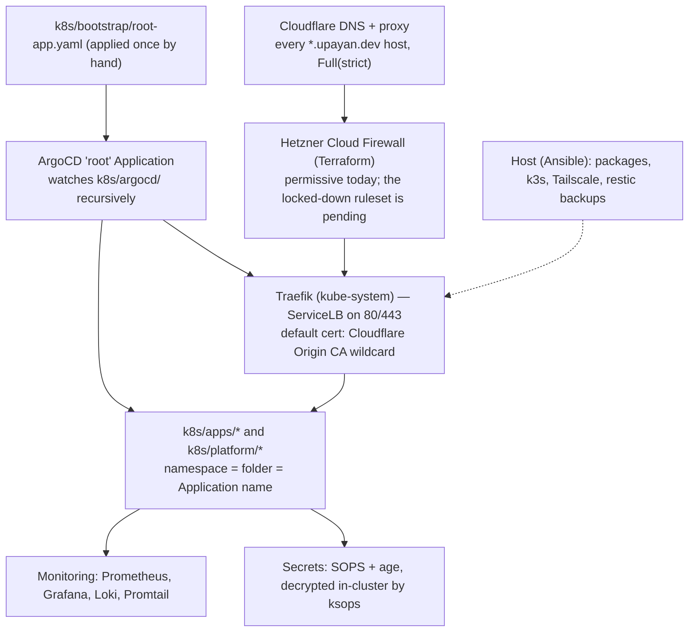

# vps — k3s GitOps cluster

GitOps source of truth for a single-node [k3s](https://k3s.io/) cluster on a Hetzner
server in Germany. It is not an application codebase: it holds Kubernetes manifests, the ArgoCD
`Application`/`ApplicationSet`/`AppProject` resources that deploy them, the Ansible that configures
the host, the port/backup inventory, and the operational docs. `main` is the only branch, and ArgoCD
reconciles it automatically — so **the git tree is the live cluster state**.

> **Relationship to `github.com/upayanmazumder/cluster`.** This tree is published to
> `cluster`, which is (or is becoming) the operational source of truth ArgoCD watches; the private
> `vps` repository it is exported from is retired to an archive. Both carry the same content, so
> read either one. A background job, `argocd-image-updater`, commits resolved image digests back to
> `main` as `build: automatic update of <app>` commits authored by
> `noodle <noodle@upayan.dev>` (renamed 2026-10-03 from `argocd-image-updater
> <image-updater@upayan.dev>`; see `docs/assets/noodle/README.md`) — those are the intended
> write-back and should not be reverted.

## Architecture



Layering, and who owns what:

- **Cloudflare** terminates TLS at the edge and proxies every hostname; the origin presents a
  Cloudflare Origin CA wildcard (`*.upayan.dev`) as Traefik's default certificate. There are no
  per-app TLS Secrets and no ACME — see [`docs/certificates.md`](docs/certificates.md).
- **Hetzner Cloud Firewall** is the only packet filter this tooling manages. It is deliberately
  permissive today; the target state and the closed/open port registry are in
  [`docs/ports.md`](docs/ports.md) and [`docs/networking.md`](docs/networking.md).
- **Traefik** is the single ingress, bundled with k3s, bound by the `kube-system/traefik`
  LoadBalancer.
- **ArgoCD** is app-of-apps: `root` points at `k8s/argocd/` and creates the projects, applications
  and ApplicationSets. Every app but `hetzner-csi` has `prune: true, selfHeal: true`.
- **Secrets** are SOPS/age-encrypted `secrets.sops.yaml` files, decrypted in-cluster by a `ksops`
  generator — there is no plaintext `Secret` in the tree and no plaintext credential in a committed
  file. See [`docs/secrets.md`](docs/secrets.md) and [`.claude/skills/secrets-tls/SKILL.md`](.claude/skills/secrets-tls/SKILL.md).
- **Backups** are restic snapshots (class-A every 30 min, daily class C, etcd every 12 h) with an
  hourly offsite copy to Cloudflare R2. See [`docs/backups.md`](docs/backups.md).

## Stack

| Layer | What |
|---|---|
| Host | Hetzner `vps`, k3s `v1.34.4+k3s1`, Ansible-managed (`ansible/`) |
| Edge | Cloudflare proxy + Origin CA wildcard certificate; Traefik |
| GitOps | ArgoCD `v2.14.x`, `argocd-image-updater`, `keda` + `keda-add-ons-http` |
| Secrets | SOPS + age, `ksops` generator in the ArgoCD repo-server |
| Monitoring | Prometheus, Grafana, Loki, Promtail, kube-state-metrics, node-exporter |
| Backups | restic (node-local repo) + Cloudflare R2 offsite; etcd snapshots |
| IaC | Terraform for the provider layer — `terraform/` in this repository (13 `.tf` files; state in R2). This row said "`terraform/` here is a pointer", written while the tree was still exported from the private `vps` repo; `cluster` **is** the owning checkout, which is what `scripts/tf.sh` refuses to run outside of |

## Directory map

```
k8s/
  bootstrap/            root Application + bootstrap notes (applied once by hand)
  argocd/
    projects/           AppProjects (apps, platform, vcap) — sourceRepos allowlists
    applications/       explicit Applications (platform/, apps/, vcap/)
    applicationsets/    apps.yaml — list generator, one element per single-image app
  apps/<app>/           per-app Kustomize manifests; folder name = namespace = Application name
  platform/             argocd, argocd-image-updater, traefik, keda, priority-classes
  monitoring/           Prometheus, Grafana, Loki, Promtail
  hetzner-csi/          vendored Hetzner CSI render (present, not load-bearing)
ansible/                host configuration (k3s, Tailscale, sshd, restic + backup timers)
inventory/ports.yaml    machine-readable port registry (docs/ports.md is its human render)
docs/                   operational docs — architecture, storage, backups, DR, ports, runbooks, ADRs
changelog/              forensic timeline of every change (git and break-glass), split by month
scripts/                validation + inventory scripts (render-all, check-secrets, check-links, …)
terraform/              the provider layer: Hetzner server/IPs/firewall, R2 buckets, Cloudflare zone
                        settings and Access. Run it only through `scripts/tf.sh`
.claude/                agent rules, skills and sub-agent specs used to work in this repo
.github/workflows/      CI: render, schema, secret scan, redaction, lint
```

## Getting started

- **Bootstrap a fresh cluster:** [`k8s/bootstrap/README.md`](k8s/bootstrap/README.md) — order of
  operations, the root Application, and the one manifest ever applied by hand.
- **Repo conventions and hard rules:** [`AGENTS.md`](AGENTS.md) and [`.claude/CLAUDE.md`](.claude/CLAUDE.md).
- **Operational docs index:** [`docs/README.md`](docs/README.md).

## Disaster recovery

- [What survives what, and how to recover now](docs/disaster-recovery.md)
- [Recover from full VM loss](docs/runbooks/recover-vm.md)
- [Restore k3s / etcd from a snapshot](docs/runbooks/recover-k3s.md)

## License and security

MIT — see [`LICENSE`](LICENSE). Do not open a public issue for a vulnerability; follow
[`SECURITY.md`](SECURITY.md) instead.
