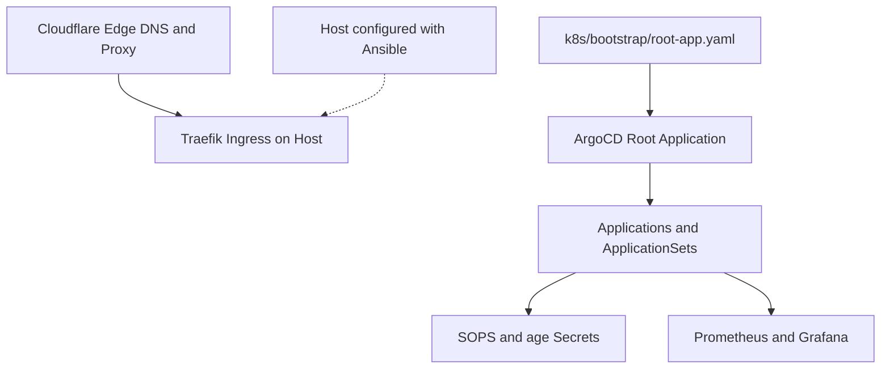

# cluster

This repository is the GitOps source of truth for a single-node k3s cluster on Hetzner Cloud.
All Kubernetes manifests live in `k8s/`.
ArgoCD reconciles cluster state from the `main` branch automatically.

## Architecture



- **Cloudflare**: Proxies traffic and provides edge SSL termination.
- **Traefik**: Serves ingress traffic with a Cloudflare Origin CA certificate.
- **ArgoCD**: Reconciles applications through an app-of-apps pattern.
- **Secrets**: Encrypted with SOPS and age. The `ksops` plugin decrypts secrets in-cluster.
- **Backups**: Restic snapshots mirror locally and replicate to Cloudflare R2 offsite storage.

## Component Stack

| Layer | Technology |
|---|---|
| Host | Hetzner Cloud, k3s, Ansible |
| Edge | Cloudflare Proxy, Traefik |
| GitOps | ArgoCD, argocd-image-updater, KEDA |
| Secrets | SOPS, age, ksops |
| Monitoring | Prometheus, Grafana, Loki, Promtail |
| Backups | Restic, Cloudflare R2 |
| Infrastructure | Terraform |

## Directory Map

```
k8s/
  bootstrap/       Root application manifest
  argocd/          AppProjects and Application definitions
  apps/            Application workloads
  platform/        Cluster platform components
  monitoring/      Prometheus, Grafana, and Loki manifests
ansible/           Host configuration playbooks
docs/              Operational documentation and runbooks
scripts/           Validation and operational scripts
terraform/         Hetzner and Cloudflare resources
.claude/           Agent specifications and operational skills
```

## Workflow

1. Create a feature branch.
2. Edit manifests under `k8s/`.
3. Push changes to GitHub.
4. Confirm that all automated CI checks pass.
5. Merge the pull request into `main`.
6. ArgoCD synchronizes cluster state automatically.

`argocd-image-updater` commits image digest updates directly to `main`.
Do not revert these commits.

## Documentation

- [Getting Started](k8s/bootstrap/README.md)
- [Operational Documentation](docs/README.md)
- [Disaster Recovery](docs/disaster-recovery.md)
- [VM Recovery Runbook](docs/runbooks/recover-vm.md)
- [Cluster Recovery Runbook](docs/runbooks/recover-k3s.md)
- [Repository Guidelines](AGENTS.md)
